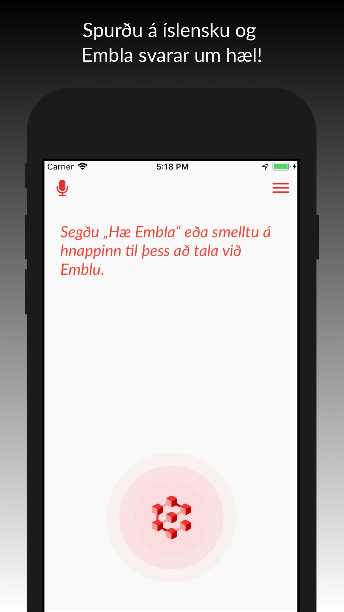
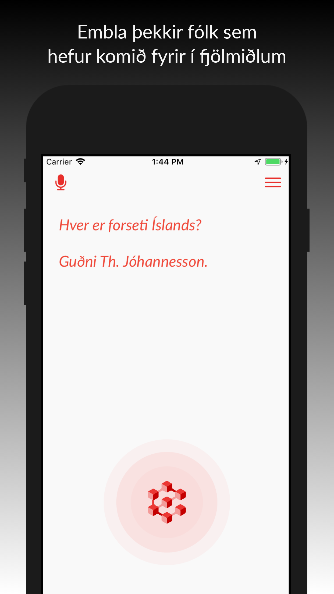
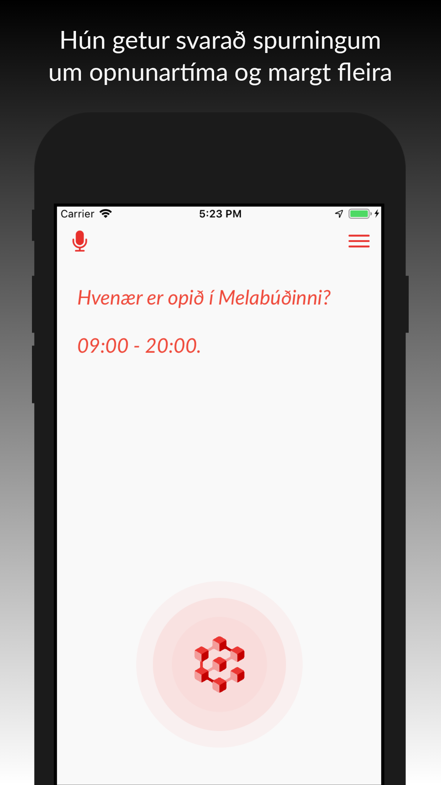

# Embla iOS client

Embla is a voice-driven virtual assistant app that uses the Icelandic-language 
[Greynir](https://greynir.is) query engine. This is the repository for the native Embla iOS client.

Written in Objective-C for iOS 12.0+. Probably only builds on a recent version of macOS.

## Build instructions

Building the app requires [Xcode](https://developer.apple.com/xcode/) 11+ and [CocoaPods](https://cocoapods.org).

After cloning the repository, run the following command from the repo root:

```
$ pod install
```

Once installation is complete, open `Embla.xcworkspace` with Xcode and build. Alternatively, you can build an 
unsigned debug app binary by running the build script from the repository root:

```
$ ./build.sh
```

The build script requires [`xcpretty`](https://github.com/xcpretty/xcpretty), which you can install with the following 
command:

```
sudo gem install xcpretty
```

NB: In order to function correctly, the app requires a valid API key for Google's Speech-to-Text API. The key should
be  saved in the following text file:

* `Keys/GoogleAPI.key`

## Screenshots

<p float="left">
  
   
  
</p>

## Credits

The Embla iOS client uses Carnegie Mellon University's [Pocketsphinx](https://github.com/cmusphinx/pocketsphinx)
and Politepix’s [OpenEars](http://www.politepix.com/openears) for hotword detection,  and Google's
[Speech-to-Text API](https://cloud.google.com/speech-to-text) for speech recognition. Speech synthesis is
accomplished via voices commissioned by [Blindrafélagið](https://blind.is), the Icelandic Association of the Visually Impaired.

## GPL License

The Embla source code is Copyright (C) 2021 [Miðeind ehf.](https://mideind.is)

<a href="https://mideind.is"></a>

This program and its source code is free software: you can redistribute it and/or modify it
under the terms of the GNU General Public License as published by the Free
Software Foundation, either version 3 of the License, or (at your option) any later
version.

This program is distributed in the hope that it will be useful, but WITHOUT
ANY WARRANTY; without even the implied warranty of MERCHANTABILITY or FITNESS FOR
A PARTICULAR PURPOSE. See the GNU General Public License for more details.

The full text of the GNU General Public License v3 is
[included here](https://github.com/mideind/Embla_iOS/blob/master/LICENSE.txt)
and also available here:
[https://www.gnu.org/licenses/gpl-3.0.html](https://www.gnu.org/licenses/gpl-3.0.html).

If you wish to use this program in ways that are not covered under the
GNU GPLv3 license, please contact us at [mideind@mideind.is](mailto:mideind@mideind.is)
to negotiate a custom license. This applies for instance if you want to include or use
this software, in part or in full, in other software that is not licensed under
GNU GPLv3 or other compatible licenses.

The Embla logo, icon and other associated images are Copyright (C) 2021 [Miðeind ehf.](https://mideind.is)
an may not be used without permission.
